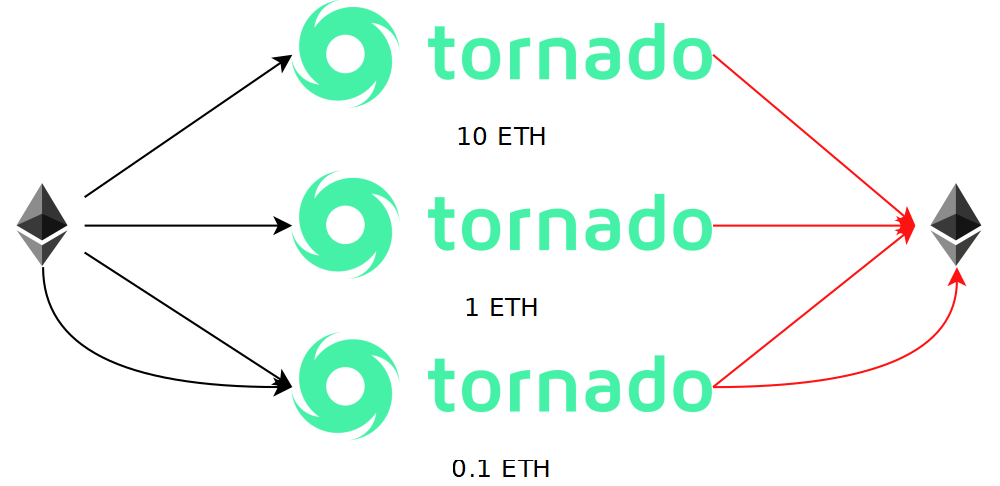

# Heuristics to de-anonymize Tornado Cash users
This code was written for the [Spring Semester Seminar in Cryptology and Data Security at the university of Bern](https://crypto.unibe.ch/courses/). If you are not interested in (or already know) the theoretical background and just want to run the program, see the [usage section](#usage) below.

## Tornado Cash
[Tornado Cash](https://tornado.cash/) is a mixer for ethereum. Users can deposit ether to/withdraw ether from different pools (e.g., 0.1 ETH, 1 ETH, 10 ETH or 100 ETH). Technically, depositing is done by calling smart contracts with zk-SNARK commitments (zk-SNARK is a [Non-Interactive Zero Knowledge Proof](https://en.wikipedia.org/wiki/Non-interactive_zero-knowledge_proof) implementation). To withdraw ether, users provide a zk-SNARK proof, proving that they indeed have deposited some ether before (of course without revealing which commitment they have sent).

## Heuristics for de-anonymization
Users can make errors when using Tornado Cash. [This paper](https://arxiv.org/abs/2201.06811) describes some common errors which can be abused to make guesses about the identity of Tornado Cash users. An implementation of these heuristics (together with other interesting tools for analyzing the Ethereum blockchain) was developed by the authors of the aforementioned paper and can be found [here](https://tutela.xyz/).

The program in this repo implements two of these heuristics, namely those that
* do still work (as opposed to the "unique gas price" heuristic)
* do not require more data than the transaction history of the Tornado Cash pool contracts (for example the "linked address" heurisitc requires the *full* transaction history of every address that ever deposited or withdrew ether from a pool)

The two heuristics implemented here are described in the next two subsections.

### Address Match Heuristic


This heuristics looks for addresses that were used to make a deposit to a pool and were later used to make a withdraw from the same pool. It is likely that this mistake is most often made by unexperianced users that do not fully understand how Tornado Cash works. The fact that this mistake is more often made with lower amounts of ether speaks for this hypothesis.

It is worth mentioning that in my implementation the assumption is made that we should not consider "same address" matches for withdrawals that do not use a relayer. Read up on more on [relayers](https://docs.tornado.cash/general/how-to-become-a-relayer) and [TORN mining](https://docs.tornado.cash/general/torn) to fully understand this assumption. For short: if you do not use a relayer when you withdraw ether, it is likely that you do not care about privacy and hence you might be in only for mining TORN.

### Multiple Denomination Heurisitc


Here we look for unique patterns of deposits and withdrawals. The picture above illustrates it well: an address may deposit certain amounts and another address then withdraws the exact same amounts. If there is a unique "match", it is considered likely that both addresses are operated by the same person.

## Usage
### Build binary
After cloning the repo, `cd` into the new folder and build a release build using cargo (if you do not have cargo installed, see [here](https://rustup.rs/)):
```bash
cargo build --release
```
### Retrieve Data
To get the latest blockchain data from [Etherscan](https://etherscan.io/), use [get_tornado_cash_data.py](get_tornado_cash_data.py):
```bash
ETHERSCAN_API_KEY=YourApiKeyToken python get_tornado_cash_data.py
```
**Notice that you can actually use "YourAoiKeyToken" as API key!** The script may, however, run faster, if you provide your own API key.

This will create five `.json` files in the current folder:
```bash
$ ls -1 TORNADO_CASH_*
TORNADO_CASH_0_1ETH.json
TORNADO_CASH_100ETH.json
TORNADO_CASH_10ETH.json
TORNADO_CASH_1ETH.json
TORNADO_CASH_ROUTER.json
```

### Running the application
The release build can be found at `./target/release/tornado_cash_heuristics`. You can get help in the usual way:
```bash
$ ./target/release/tornado_cash_heuristics -h
tornado_cash_heuristics 0.1
David Herrmann <david.herrmann@protonmail.com>

USAGE:
    tornado_cash_heuristics [OPTIONS] [--] [files]...

ARGS:
    <files>...    

OPTIONS:
    -e, --heuristics <heuristics>...    Comma-separated list of heuristics to use
    -h, --help                          Print help information
    -l, --list                          List available heuristics
    -v, --verbose                       Print details (e.g., revealing transactions etc.)
    -V, --version                       Print version information
```

You can select heuristic to use by providing a comma-separated list of heuristic names with '-e/--heuristics'. If you do not select specific heuristics, the program will run all those available. To get a list of available heuristics, use `-l`. You will also have to provide the files containing the blockchain data in JSON format obtained with the python script (see above). So for example to get verbose results (i.e., containing addresses and transactions hashes) from the `multiple_deposits` and the `address_match` heuristics, run the following:
```bash
$ ./target/release/tornado_cash_heuristics -e address_match,multiple_denomination -v TORNADO_CASH_*
loaded 50266 deposits, 46640 withdraws
344 potentially compromised addresses in the 0.1 ETH pool (analysed 8769 deposits and 7580 withdraws)
0x3e90d01ee8f7c83742f42ad34cd11cb4f92d7fa4 deposited at 0x87799ea678325d2ff6d1d555e6806356ec2a4fde56fc002aecf34136e4f72ca7, 0xcd45af55dd5f83a4c31d3a9857195c3f144861291737869d648db92d80f9950e and withdrew at 0x9b0ee8acfbd2c8c0935fd8dd26999951dcc0a746b04d1dfc06f02126ef84f8c2
...
52 unique deposit/withdraw patterns found
0x64e6fdd639e1811272fd5b0bc051580e84bf93bc and 0x89261103fa88a913c8d0debd00574fd16895407d have the same deposit/withdraw pattern
0x917a417d938b9f9e6ae7f9e5253fb6de410343e3 and 0xb3d8dc6b0c9fec01afbc69e282ef720e2ef412d4 have the same deposit/withdraw pattern
...
```